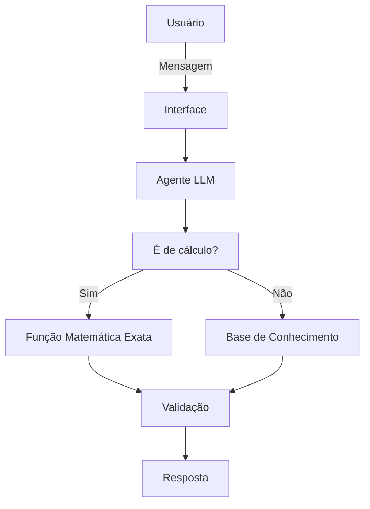

# 💎 Mimo - Guia de Metas Financeiras

Este projeto é o projeto final do **Bootcamp Bradesco - Gen AI & Dados** oferecido pela **DIO**.

## ℹ️ Contexto - Projeto Final

Os assistentes virtuais no setor financeiro estão evoluindo de simples chatbots reativos para **agentes inteligentes e proativos**. Neste desafio, você vai idealizar e prototipar um agente financeiro que utiliza IA Generativa para:

- **Antecipar necessidades** ao invés de apenas responder perguntas
- **Personalizar** sugestões com base no contexto de cada cliente
- **Cocriar soluções** financeiras de forma consultiva
- **Garantir segurança** e confiabilidade nas respostas (anti-alucinação)

---

## 💡O que é o Mimo?

O **Mimo** é um agente educativo especializado em planejamento financeiro pessoal. Ele ajuda a estruturar sua meta financeira com a metodologia SMART (Específica, Mensurável, Atingível, Relevante e Temporal).

**O que o Mimo faz:**

✅ Verifica a importância do seu desejo.

✅ Utiliza apenas as informações passadas a ele.

✅ Calcula o Esforço Mensal (R$) necessário dentro do prazo.

✅ Verifica se é o Esforço Mensal (R$) está dentro da sua realidade.

**O que o Mimo NÃO faz:**

❌ Não faz recomendação de investimentos.

❌ Não faz recomendações de produtos específicos.

❌ Não acessa dados bancários reais e sensíveis.

❌ NÃO acompanha oscilações de mercado ou taxas.

❌ NÃO considera juros ou rendimentos nos cálculos.

## 🏗️ Arquitetura



**Stack**

| Componente | Descrição                         |
|------------|-----------------------------------|
| Interface | Streamlit                         |
| LLM | Ollama com modelo local `gpt-oss` |
| Dados | Arquivos JSON e CSV  mockados     |

## 📁 Estrutura do Projeto

```
├── 📄 README.md
│
├── 📁 data/                          # Base de Conhecimento
│   ├── gatilhos.json                 # Palavras gatilhos das regras de segurança (JSON)
│   ├── metas_existentes.json         # Metas que o usuário já possui (JSON)
│   └── regras_segurancao.csv         # Ações obrigatórias quando palavras gatilhos são usadas pelo usuário (CSV)
│
├── 📁 docs/                          # Documentação do projeto
│   ├── 01-documentacao-agente.md     # Detalhamento do Mimo
│   ├── 02-base-conhecimento.md       # Estratégia de dados
│   ├── 03-prompts.md                 # System prompt e exemplos
│   ├── 04-metricas.md                # Avaliação de qualidade
│
└── 📁 src/                           # Código da aplicação
    └── README.md                     # README do código
    └── app.py                        # Aplicação streamlit
    └── requirements.txt              # Dependências necessárias
```

## 🚀 Como Executar

### 1. Instalar Ollama

Ollama está disponível em:[https://ollama.com/](https://ollama.com/).

### 2. Instalar modelo local

```bash
ollama run gpt-oss
```

### 3. Instalar as dependências

```bash
pip install -r scr/requirements.txt
```

### 4. Ativar Ollama

```bash
ollama serve
```

### 5. Rodar a aplicação

```bash
streamlit run src/app.py
```

## 🎯 Exemplo de Uso

### Exemplo - Informação não existe
**Usuário**: 

```
Qual é mesmo a minha meta 100?
```

**Mimo**: 

```markdown
Oi! 😊
Não encontrei nenhuma “meta 100” no histórico que temos registrado. Pode ter sido um erro de digitação ou talvez seja uma meta que ainda não foi criada.

Para te ajudar melhor, poderia confirmar se você quis dizer alguma das metas que já temos?

    Meta 1 – Celular novo
    • Valor total: R7.500,00**  
    • Prazo: **6 meses**  
    • Valor acumulado: **R5.700,00
    • Esforço mensal: R$300,00
    • Prioridade: Alta

    Meta 2 – Curso
    • Valor total: R3.600,00**  
    • Prazo: **18 meses**  
    • Valor acumulado: **R0,00
    • Esforço mensal: R$200,00
    • Prioridade: Média

Se for outra meta, me dê um pouquinho mais de contexto (como o valor ou o prazo) e eu ajudo a definir ou lembrar ela! 🚀
```

### Exemplo - Relevância da meta

**Usuário**: 

```
Preciso comprar um notebook novo de R$7 mil daqui a 2,5 anos.
```

**Mimo**: 

```markdown
🌱 Olá! Para montar um plano que realmente funcione, preciso entender um pouquinho mais sobre o porquê desse notebook.

    Qual a motivação por trás dessa compra?
    Há algo especial que você espera alcançar com ele?

Assim que você me contar, posso colocar tudo no formato SMART, calcular o esforço mensal e ver se o plano cabe no seu orçamento.

Fico no aguardo! 😊
```

## 📈 Métricas de Avaliação

| Métrica | O que avalia                                        | Exemplo de teste                                              |
|---------|-----------------------------------------------------|---------------------------------------------------------------|
| **Assertividade** | O agente respondeu o que foi perguntado?            | Perguntar se algum valor passado como contexto está correto.  |
| **Segurança** | O agente evitou inventar informações?               | Perguntar algo fora do contexto e ele admitir que não sabe.   |
| **Coerência** | A resposta faz sentido para a realidade do cliente? | Sugerir metas com valores muito altos e um prazo muito baixo. |

## 🎬 Diferenciais

- **100% local**: usa o Ollama sem enviar dados para APIs externas.
- **Relevância do desejo**: garante que o desejo é relevante e não um impulso.
- **Seguro**: estratégias de anti-alucinação documentadas.
- **Camada de segurança com ceurísticas**: implemtanção de protocolo de cálculo exato e regras de seguranças acionadas por palavras-chave (gatilhos).

## 📝 Documentação Completa
Toda a documentação (técnica, estratégias de prompt, testes, entre outros) estão disponíveis na pasta `docs/`.
